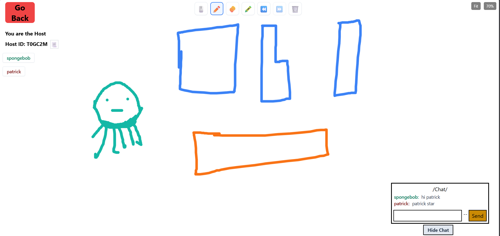

# Whiteboard Learning Project

This is a collaborative whiteboard application built as a learning project to explore WebSockets and the HTML5 Canvas API. **Note: This is just a learning project, not a real production-ready utility.**



## Tools Used

### Frontend (`/App`)
- **React.js** - UI Library
- **Vite** - Build Tool & Development Server
- **Tailwind CSS** - Styling
- **HTML5 Canvas** - Drawing functionality

### Backend (`/server`)
- **Node.js & Express.js** - Server framework
- **Socket.io / ws** - WebSocket communication for real-time drawing
- **MongoDB (Mongoose)** - Database for users and session rooms
- **bcrypt** - Password hashing

## How to Run Locally

To get this project running on your local machine, you will need to start both the frontend and backend servers.

### 1. Prerequisites
- [Node.js](https://nodejs.org/) installed
- [MongoDB](https://www.mongodb.com/try/download/community) installed and running locally, or a MongoDB Atlas account.

### 2. Backend Setup
Navigate to the `server` directory, install dependencies, and start the server:

```bash
cd server
npm install
```

Create a `.env` file in the `server` directory and add your MongoDB connection strings:
```env
mongoLocalURL="mongodb://127.0.0.1:27017/whiteboard"
# Optional: If you prefer using Atlas locally
# mongoAtlasURL="your_mongodb_atlas_connection_string"
```

Start the backend server:
```bash
node server.js
```
The server will run on `http://localhost:8080`.

### 3. Frontend Setup
Open a new terminal, navigate to the `App` directory, install dependencies, and start the development server:

```bash
cd App
npm install
npm run dev
```
The frontend will typically run on `http://localhost:5173`. Open this URL in your browser to see the application.

## How to Deploy for Yourself

If you wish to host this project yourself, you will need to deploy the frontend and backend separately.

### Deploying the Backend
1. **Database:** Create a cluster on [MongoDB Atlas](https://www.mongodb.com/cloud/atlas) and get your connection string.
2. **Hosting:** Use a service like [Render](https://render.com), [Railway](https://railway.app/), or [Heroku](https://heroku.com).
3. **Environment Variables:** When deploying the server, make sure to add your MongoDB connection string as an environment variable (e.g., `mongoLocalURL` or `mongoAtlasURL` depending on how you configure it).

### Deploying the Frontend
1. **Build:** First, build the frontend for production by running:
   ```bash
   cd App
   npm run build
   ```
2. **Hosting:** Deploy the `/App` directory (or specifically the `dist` folder generated after the build) to static hosting services like [Vercel](https://vercel.com), [Netlify](https://netlify.com), or GitHub Pages.
3. **API Configuration:** Make sure your frontend API requests and WebSocket connections point to your deployed backend URL instead of `localhost:8080`.
